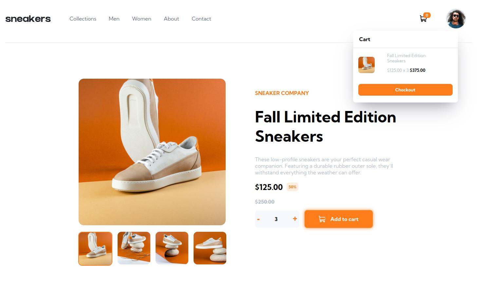
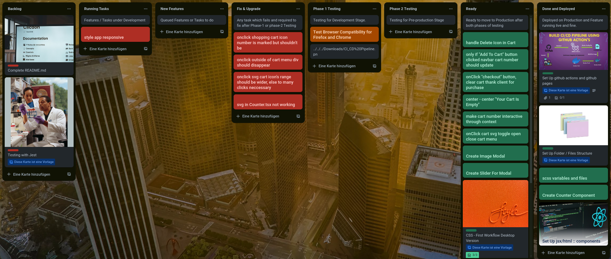

# Frontend Mentor - E-commerce product page solution

This is a solution to the [E-commerce product page challenge on Frontend Mentor](https://www.frontendmentor.io/challenges/ecommerce-product-page-UPsZ9MJp6). Frontend Mentor challenges help you improve your coding skills by building realistic projects.

## Table of contents

- [Overview](#overview)
  - [The challenge](#the-challenge)
  - [Screenshot](#screenshot)
  - [Links](#links)
- [My process](#my-process)
  - [Built with](#built-with)
  - [Code Snippets](#code-sn)
  - [Continued development](#continued-development)
  - [Useful resources](#useful-resources)
- [Author](#author)
- [Tags](#tags)


## Overview

### The challenge

Users should be able to:

- View the optimal layout for the site depending on their device's screen size
- See hover states for all interactive elements on the page
- Open a lightbox gallery by clicking on the large product image
- Switch the large product image by clicking on the small thumbnail images
- Add items to the cart
- View the cart and remove items from it

### Screenshot



### Links

- Solution URL: [frontendmentor.io]()
- View Live Site: [deployed on github pages:](https://cipivlad.github.io/ecommerce-product-page/)

## My process

### Built with

- Project Management Tool: [Trello](https://trello.com/b/LzYHEZdo/e-commerce-product-page-frontendmentor) 


- DevOps Tools: CI/CD with github actions and pages
- IDE: vscode
- Module Bundler: vite
- Package Manager: npm
- Frameworks/Libraries/Supersets: SASS, React, Typescript, 
- [Framer Motion ](https://www.framer.com/motion/examples/) for Lightbox / Modal
- Deployment: github
- Browsers: Google Chrome, Firefox
- css-first workflow
- [React](https://reactjs.org/) - JS library

### Code Snippets

Framer Motion for Lightbox

```js
<AnimatePresence>
            {openModal && (
                <motion.div
                    initial={{ opacity: 0 }}
                    animate={{ opacity: 1 }}
                    exit={{ opacity: 0 }}
                    transition={{ duration: 0.2 }}
                    className="overlay"
                    style={{
                        position: "fixed",
                        top: 0,
                        left: 0,
                        right: 0,
                        bottom: 0,
                        backgroundColor: "rgba(0,0,0,0.75)",
                        display: "grid",
                        zIndex: 999999
                    }}
                >
                ...

```

### Useful resources

- [Lightbox](https://www.framer.com/motion/examples/) - This helped me to . I really liked this pattern and will use it going forward.
- [Sidebar](https://www.w3schools.com/w3css/w3css_sidebar.asp) - This is an amazing article which helped me to create a sidebar. I'd recommend it to anyone still learning this concept.
- [SVG](https://css-tricks.com/change-color-of-svg-on-hover/) - This helped me to gain greater insight of working with svg's in general.


## Author

- Website - [Portfolio](https://cipivlad.github.io/myportfoliosite/)
- Frontend Mentor - [@CipiVlad](https://www.frontendmentor.io/profile/CipiVlad)
- DEV.to [https://dev.to/cipivlad](https://dev.to/cipivlad)

## Tags

#react, #typescript, #scss, #vite, #github, #react-router

